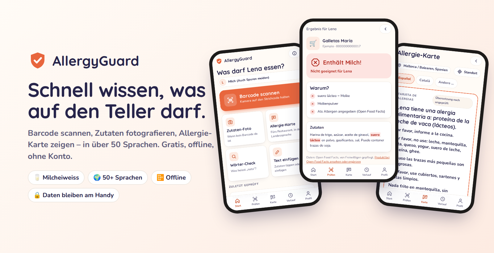
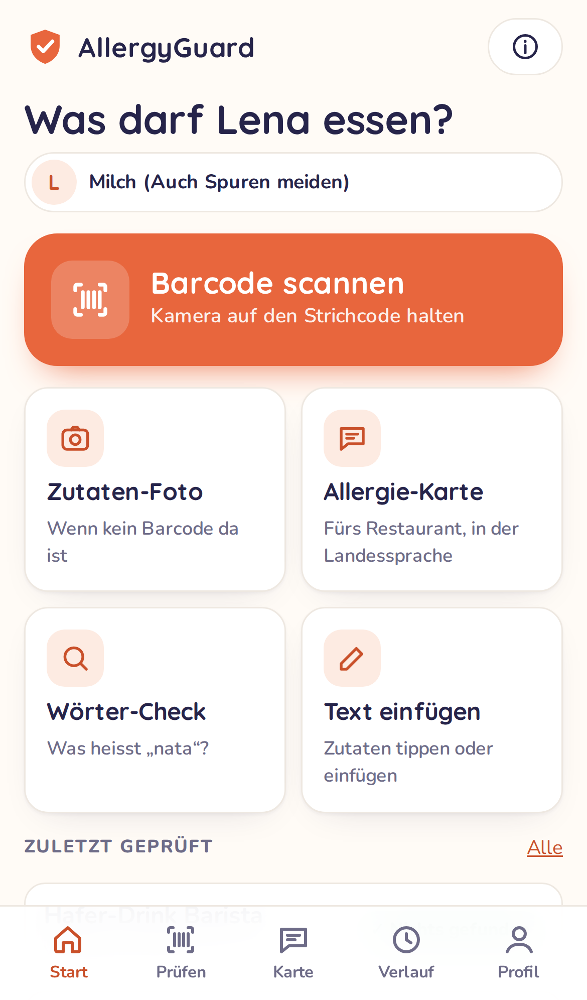
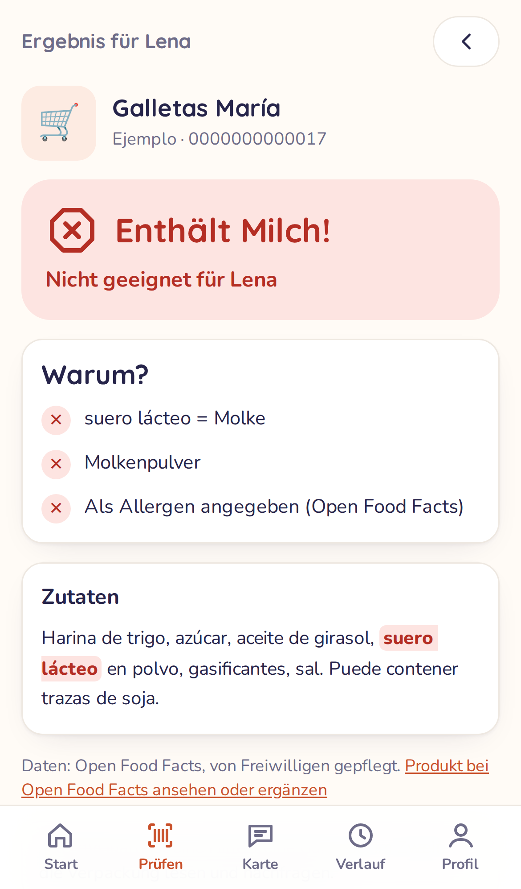
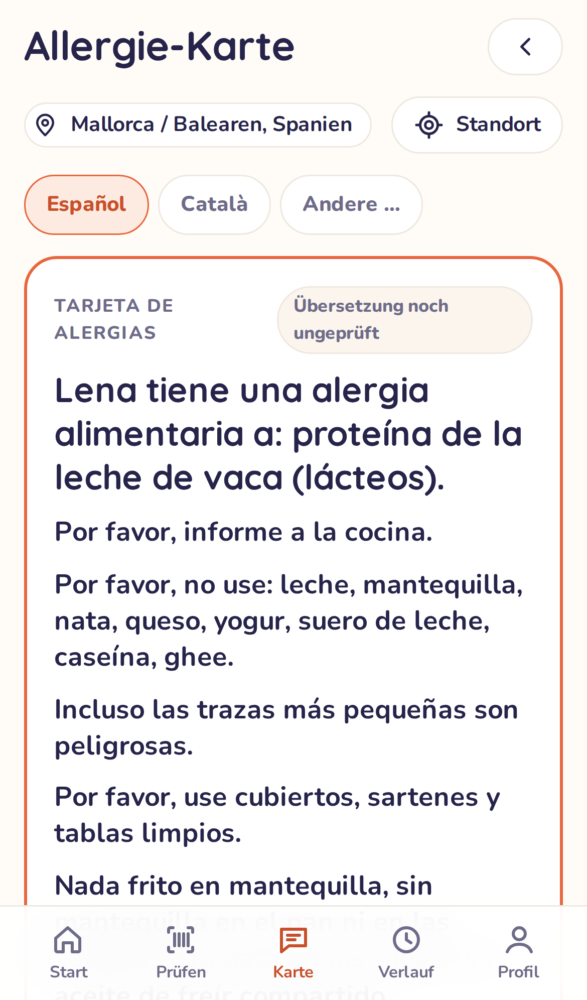
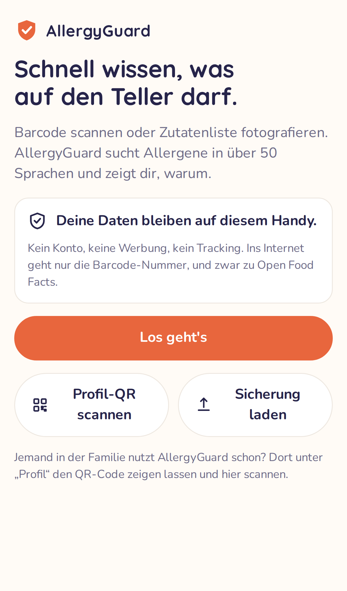
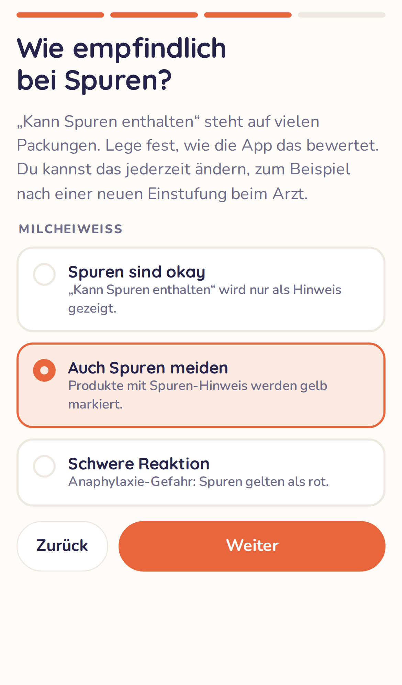
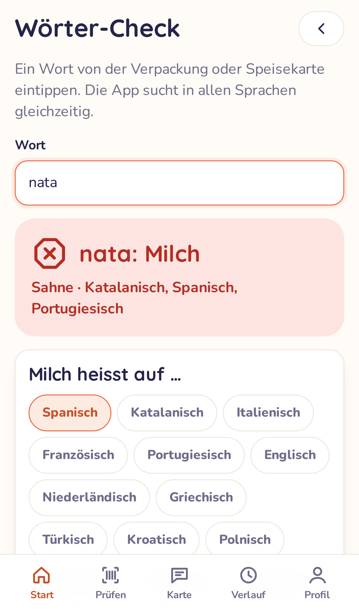
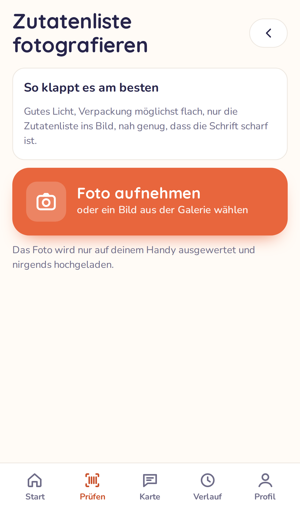
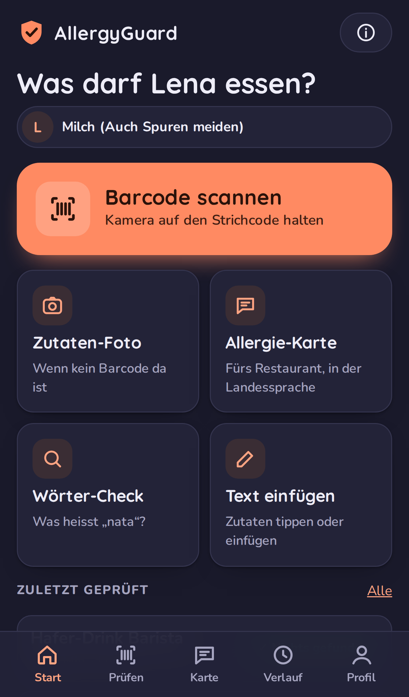

# AllergyGuard

**Barcode scannen, Zutaten fotografieren, Allergie-Karte zeigen.** 
Für Eltern, Familien und alle, die mit einer Lebensmittelallergie unterwegs sind.

### [👉 App öffnen](https://gsb-deleven.github.io/AllergyGuard/)

Am iPhone in Safari öffnen → Teilen → „Zum Home-Bildschirm“. Fertig.

---

## Warum es AllergyGuard gibt

AllergyGuard entstand im Alltag einer Familie mit einem Kind mit **Milcheiweiss-Allergie**. Jede Packung umdrehen, jede Zutatenliste Wort für Wort lesen und im Ausland raten, ob *suero lácteo*, *latticello* oder *γάλα* Milch bedeutet: Das kostet Nerven. Dazu kommt, dass sich die Empfindlichkeit ändern kann. Eine Zeit lang sind sogar Spuren tabu, später sind sie okay.

AllergyGuard nimmt diese Arbeit ab. Es ist ehrlich, wenn es etwas nicht weiss, und zeigt immer, **warum** es zu seinem Ergebnis kommt.

## So funktioniert's

<table>
<tr>
<td width="33%" align="center"> <b>1. Scannen</b> Barcode in den Rahmen halten, oder die Zutatenliste fotografieren.</td>
<td width="33%" align="center"> <b>2. Ergebnis mit Begründung</b> Rot, Gelb, Grün oder „Keine Daten“, mit dem Wort, das den Ausschlag gab.</td>
<td width="33%" align="center"> <b>3. Im Restaurant</b> Allergie-Karte in der Landessprache zeigen oder vorlesen lassen.</td>
</tr>
</table>

## Was die App kann

| | Funktion | Beschreibung |
|---|---|---|
| 📷 | **Barcode-Scan** | Produktdaten aus [Open Food Facts](https://world.openfoodfacts.org), der grössten offenen Lebensmitteldatenbank |
| 📄 | **Zutaten-Foto** | Texterkennung **direkt auf dem Handy**, auch offline. Das Foto verlässt das Gerät nie |
| 🌍 | **Alle Sprachen gleichzeitig** | Über 7'000 Begriffe, davon über 4'000 für Milch, in mehr als 50 Sprachen: *nata, burro, lactosérum, süt tozu …* |
| 🥛 | **Spuren-Stufe pro Allergen** | „Spuren sind okay“, „Auch Spuren meiden“ oder „Schwere Reaktion“, jederzeit änderbar |
| 🗣️ | **Allergie-Karte** | Für Restaurant und Hotel, in 11 Sprachen, mit Vorlese-Funktion, passend zum Ort (z. B. Mallorca → Spanisch + Katalanisch) |
| 🔎 | **Wörter-Check** | „Was heisst *latticello*?“ → Buttermilch |
| 👨‍👩‍👧 | **Mehrere Personen** | Profile für die ganze Familie, Teilen per QR-Code |
| 📴 | **Offline** | Funktioniert in der Tiefgarage, im Flugzeug und im Ausland ohne Daten |
| 🔒 | **Privat** | Kein Konto, keine Werbung, kein Tracking. Alles bleibt auf dem Handy |

<b>🖼️ Mehr Screenshots</b>

 

## Die vier Ergebnisse

| Anzeige | Bedeutung |
|---|---|
| ⛔ **Enthält …!** | Das Allergen steht in den Zutaten oder in den Allergen-Angaben. |
| ⚠️ **Achtung, unsicher** | „Kann Spuren enthalten“ (je nach deiner Einstellung) oder ein Wort, das *oft* das Allergen enthält, z. B. Margarine. |
| ✅ **Nichts gefunden** | In den vorhandenen Angaben steht nichts davon. Das ist keine Garantie, und die App sagt es auch so. |
| ❔ **Keine Daten** | Es gibt keine lesbare Zutatenliste. Die App zeigt dann **nie** Grün. |

> **Grundregel:** Im Zweifel gilt immer das strengere Ergebnis. „Laktosefrei“ ist zum Beispiel nie eine Entwarnung für Milcheiweiss, denn laktosefreie Milch ist immer noch Milch.

## 📲 Installation in 30 Sekunden

1. **[Diesen Link](https://gsb-deleven.github.io/AllergyGuard/) am iPhone in Safari öffnen.** Auf Android: Chrome.
2. Unten auf **Teilen** tippen (Quadrat mit Pfeil), dann **„Zum Home-Bildschirm“**.
3. Die App vom Home-Bildschirm starten und das Profil einrichten.
4. Einmal im WLAN: **Info → „Für unterwegs vorbereiten“**, damit auch das Zutaten-Foto offline klappt.

Die ausführliche Anleitung mit Bildern steht im **[Wiki](https://github.com/GSB-Deleven/AllergyGuard/wiki)**.

## 🗺️ Roadmap

Den aktuellen Stand gibt es jederzeit in [📍 Roadmap – wo stehen wir?](https://github.com/GSB-Deleven/AllergyGuard/issues/1).

- [x] **Phase 1: Erste Version:** Barcode, Zutaten-Foto, mehrsprachige Prüfung, Allergie-Karte, Profile, offline
- [ ] **Phase 1b: Mehr offline:** Länderpakete für neue Produkte ohne Netz, weitere Schriften, geprüfte Übersetzungen
- [ ] **Phase 3: KI:** „Ist Tumbet milchfrei?“, regionale Küche, schwierige Fotos lesen
- [ ] **Phase 4: Speisekarten-Scanner:** ganze Karte fotografieren, Ampel pro Gericht

## ❓ Häufige Fragen

<b>Kostet die App etwas?</b>

Nein. Keine Kosten, kein Abo, keine Werbung. Die App liegt gratis auf GitHub Pages, die Produktdaten kommen gratis von Open Food Facts.

<b>Ist das eine „echte“ App? Warum nicht im App Store?</b>

Es ist eine Web-App (PWA). Sie läuft im Browser, lässt sich aber wie eine normale App auf den Home-Bildschirm legen, startet im Vollbild und funktioniert offline. Das spart die App-Store-Gebühren (99 USD pro Jahr bei Apple). Updates kommen automatisch, ohne Store.

<b>Wo sind meine Daten gespeichert? Brauche ich ein Konto?</b>

Kein Konto. Profile und Verlauf liegen **nur auf deinem Handy**. Beim Barcode-Scan geht nur die Barcode-Nummer an Open Food Facts. Fotos werden auf dem Handy ausgewertet und nirgends hochgeladen.

<b>Was passiert, wenn ich die App lösche?</b>

Dann löscht das iPhone auch ihre Daten. Speichere darum unter **Profil → „Sicherung speichern“** eine Datei, am besten in iCloud Drive oder in der Dateien-App. Nach einer Neuinstallation tippst du auf **„Sicherung laden“**, und alles ist wieder da. Die App erinnert dich, wenn die letzte Sicherung zu alt ist.

<b>Wie bekommt mein Partner / meine Partnerin dasselbe Profil?</b>

Unter **Profil** bei der Person auf das QR-Symbol tippen. Auf dem anderen Handy in AllergyGuard auf **„Profil-QR scannen“** tippen. Es gibt keinen Server dazwischen. Wichtig beim iPhone: Den Code in der App scannen, nicht mit der normalen Kamera. Die Home-Bildschirm-App hat nämlich einen eigenen Speicher, getrennt von Safari.

<b>Funktioniert die App ohne Internet?</b>

Grösstenteils ja: Zutaten-Foto, Allergie-Karte, Wörter-Check, Verlauf und alle schon einmal gescannten Produkte gehen offline. Neue Barcodes brauchen Internet. Ohne Netz merkt sich die App den Barcode und prüft ihn automatisch, sobald du wieder online bist. Offline-Länderpakete sind [geplant](https://github.com/GSB-Deleven/AllergyGuard/issues/17).

<b>Kann ich mich zu 100 % auf das Ergebnis verlassen?</b>

Nein, und das sagt die App auch ehrlich. Produktdaten von Freiwilligen können fehlen oder veraltet sein, Rezepturen ändern sich, und Texterkennung kann sich verlesen. AllergyGuard ist deshalb bewusst **streng**: Ohne Daten gibt es nie Grün, im Zweifel Gelb, und jedes Ergebnis zeigt, woher es kommt. Bei einer schweren Allergie gilt immer: Verpackung lesen, nachfragen, ärztliche Anweisungen befolgen.

<b>Welche Allergene werden erkannt?</b>

Alle 14 EU-Pflichtallergene: Milch, Gluten, Eier, Erdnüsse, Schalenfrüchte, Soja, Fisch, Krebstiere, Weichtiere, Sesam, Sellerie, Senf, Lupinen und Sulfite. Dazu kommt **Laktose** als eigene Unverträglichkeit. Milcheiweiss ist am gründlichsten gepflegt.

<b>Ein Produkt wurde falsch bewertet. Was tun?</b>

Im Ergebnis auf **„Falsches Ergebnis melden“** tippen. Das öffnet ein vorausgefülltes Formular hier auf GitHub. Jede Meldung verbessert die Wörterliste für alle. Fehlt ein Produkt ganz, kannst du es direkt bei Open Food Facts eintragen.

<b>Warum wird „Kokosmilch“ nicht als Milch gewertet?</b>

Weil sie keine Milch enthält. Die App kennt solche Doppelgänger (Kokosmilch, Kakaobutter, Erdnussbutter, Milchsäure …) und zeigt sie als Hinweis an. Der Rest der Zutatenliste wird trotzdem ganz normal geprüft.

<b>Die Vorlese-Funktion spricht nicht in der richtigen Sprache.</b>

Das iPhone nutzt die installierten Stimmen. Unter **Einstellungen → Bedienungshilfen → Gesprochene Inhalte → Stimmen** kannst du weitere Sprachen gratis laden.

## 🤝 Mitmachen

Du brauchst keine Programmierkenntnisse, um zu helfen:

- **Falsches Ergebnis melden** direkt aus der App
- **Übersetzung prüfen:** Sprichst du Spanisch, Italienisch, Griechisch …? [Hier entlang](https://github.com/GSB-Deleven/AllergyGuard/issues/19)
- **Produkte bei [Open Food Facts](https://world.openfoodfacts.org) ergänzen:** davon profitieren alle
- **Ideen und Fehler** als [Issue](https://github.com/GSB-Deleven/AllergyGuard/issues/new/choose)

Für Entwickler: [Wiki → Für Entwickler](https://github.com/GSB-Deleven/AllergyGuard/wiki/Fuer-Entwickler) und [docs/ARCHITEKTUR.md](docs/ARCHITEKTUR.md).

## ⚖️ Hinweis & Lizenz

AllergyGuard ist ein privates Open-Source-Projekt und **kein Medizinprodukt**. Es ersetzt weder den Blick auf die Verpackung noch ärztlichen Rat.

Quellcode: [MIT-Lizenz](LICENSE) · Produktdaten und Taxonomie: © [Open Food Facts](https://world.openfoodfacts.org), [ODbL](https://opendatacommons.org/licenses/odbl/1-0/) · Texterkennung: [Tesseract.js](https://github.com/naptha/tesseract.js) · Barcode: [ZXing](https://github.com/zxing-js/browser)

Mit ❤️ für alle, die beim Einkaufen zweimal hinschauen müssen. („Lena“ in den Screenshots ist ein Beispielprofil.)

