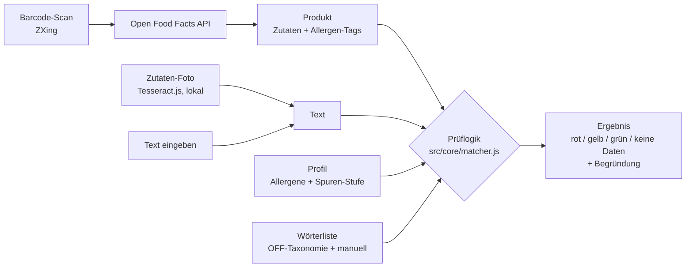

# Architektur

AllergyGuard ist eine **Progressive Web App**: reines HTML, CSS und JavaScript (ES-Module), **ohne Build-Schritt**. Was im Repository liegt, läuft genau so im Browser. Es gibt keinen Server und kein Konto. Alles läuft im Browser, gehostet auf GitHub Pages.

## Ordner

| Ordner | Inhalt |
|---|---|
| `src/core/` | Reine Logik ohne Browser-Abhängigkeit, in Node testbar: Normalisierung, Wörterliste, Prüfung, Allergie-Karte, Orte |
| `src/services/` | Open Food Facts (Netz), Texterkennung (Tesseract) |
| `src/storage/` | Lokale Speicherung (`localStorage`), Sicherung, Profil-Teilen |
| `src/ui/` | Bildschirme (`views/`) und gemeinsame Bausteine |
| `data/` | Wörterlisten, Karten-Texte, Länder/Regionen (JSON) |
| `vendor/` | Mitgelieferte Bibliotheken (kein CDN → offline, keine Fremd-Server) |
| `tests/` | `node --test`, ohne Abhängigkeiten |
| `tools/` | Wörterliste neu erzeugen, Screenshots, Schlüssel-Prüfung |

## Prüflogik (`src/core/matcher.js`)

1. **Normalisieren** (`normalize.js`): Kleinbuchstaben, Akzente entfernen (nur lateinisch/griechisch/kyrillisch), `ß → ss`. Eine Zuordnungstabelle merkt sich die Originalpositionen fürs Markieren.
2. **Doppelgänger zuerst** (`exceptions`): „Kokosmilch“, „Kakaobutter“, „Milchsäure“ usw. werden als Hinweis erkannt und aus dem Text ausgeblendet. Der Rest wird normal geprüft.
3. **Wörterliste**, längste Wörter zuerst, damit „suero de leche“ vor „leche“ gewinnt. Es gibt drei Arten zu vergleichen:
   - `word`: ganzes Wort, Plural-s/-es erlaubt (Romanische Sprachen, Englisch …)
   - `edge`: Wortanfang oder Wortende (4-Buchstaben-Wörter in Sprachen mit zusammengesetzten Wörtern)
   - `substring`: überall (Wörter ab 5 Buchstaben in DE/NL/Skandinavisch/FI/HU; Schriften ohne Leerzeichen wie CJK und Thai)
4. **Spuren-Bereiche**: Ab „kann Spuren“, „puede contener“, „may contain“ … bis zum Satzende gilt ein Treffer als Spur.
5. **Verneinung**: „laktosefrei“, „sans lait“, „sin lactosa“ zählen nicht als Treffer. „Laktosefrei“ bekommt bei Milcheiweiss aber den ausdrücklichen Hinweis, dass es **keine** Entwarnung ist.
6. **Bewertung pro Allergen** nach Spuren-Stufe, danach das schlechteste Ergebnis über alle Allergene. Ohne lesbaren Text gibt es nie „sicher“.

Rangfolge: `unsafe > caution > unknown > safe`.

## Wörterliste

- `data/synonyms.generated.json` wird von `tools/update-synonyms.mjs` aus der [Open-Food-Facts-Taxonomie](https://github.com/openfoodfacts/openfoodfacts-server/tree/main/taxonomies) erzeugt. Für Milch sind alle Zutaten unterhalb von `en:dairy`/`en:milk` in ~55 Sprachen enthalten, jeweils mit deutscher Bedeutung.
- `data/synonyms.manual.json`: von Hand gepflegte Ergänzungen, „vielleicht“-Wörter (Margarine, crema …), Doppelgänger, Spuren-Formulierungen und Verneinungen.
- Neu erzeugen: `node tools/update-synonyms.mjs`, danach `node --test`.

## Offline

`sw.js` legt beim Installieren alle App-Dateien ab („stale-while-revalidate“: sofort aus dem Speicher, im Hintergrund aktualisiert). Die Texterkennung (~27 MB) wird beim ersten Gebrauch oder über „Für unterwegs vorbereiten“ gespeichert. `tests/sw.test.js` stellt sicher, dass keine App-Datei in der Offline-Liste fehlt.

## Sicherheit & Datenschutz

- Content-Security-Policy in `index.html`: Skripte nur vom eigenen Server, Netzwerk nur zu Open Food Facts.
- Keine Cookies, kein Tracking, keine externen Schriften oder CDNs.
- Profil-Teilen per QR: Die Daten stehen im Link-Teil nach `#`. Dieser Teil wird nie an einen Server geschickt.
- `tools/check-secrets.mjs` läuft in CI und schlägt bei schlüsselähnlichen Zeichenketten Alarm.

## Entscheidungen

| Entscheidung | Warum |
|---|---|
| PWA statt nativer iOS-App | Kein Mac, keine 99 USD pro Jahr, gratis Hosting, Updates ohne App Store |
| Kein Build-Schritt | Für Anfänger nachvollziehbar, nichts kann „beim Bauen“ kaputtgehen |
| Kein Konto / Server | Gesundheitsdaten bleiben auf dem Gerät. Gratis, offline. Sync ist als [#25](https://github.com/GSB-Deleven/AllergyGuard/issues/25) vorgemerkt |
| Alle Sprachen gleichzeitig prüfen | Importware ist oft anders beschriftet als die Landessprache |
| Karten-Texte fest statt KI-übersetzt | Reproduzierbar, prüfbar, offline |
